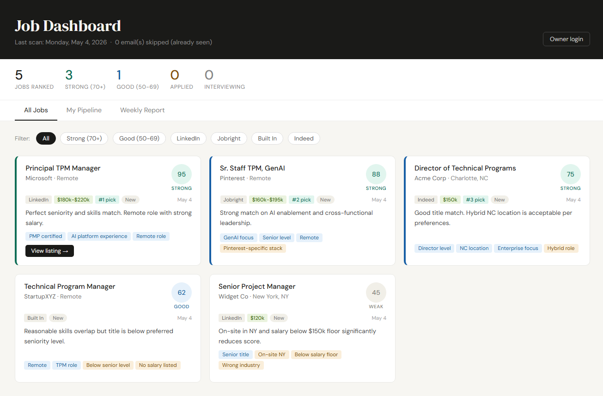

# AI Job Scanner

**An AI-powered job search automation tool that scans your inbox, extracts job listings, ranks them against your resume, and publishes a live CRM dashboard — automatically, every morning.**

Built with Node.js, the Claude API, and the Gmail API. Zero npm dependencies. Runs on your existing hardware.

---

## What it does

Every morning at 7am (or whenever you schedule it), the scanner:

1. **Reads your Gmail** — connects to a dedicated `Job Alerts` label via OAuth and finds new emails from LinkedIn, Jobright, Built In, and Indeed
2. **Extracts every job listing** — uses Claude to parse each email format and pull out title, company, location, salary, and apply URL
3. **Scores and ranks jobs 0–100** — weighted against your resume across four criteria: title/seniority match, skills overlap, remote/location fit, and salary floor
4. **Skips emails you've already seen** — deduplication prevents redundant API calls on every run after the first
5. **Publishes a live dashboard** — uploads `job_matches.html` to your web host via FTP
6. **Tracks your applications** — a built-in CRM lets you tag roles as Applied, Phone Screen, Interview, Offer, or Rejected from any device



---

## Why I built this

I was spending 1–2 hours per day manually reviewing job alert emails, copying interesting listings into Claude, evaluating them against my resume, and tracking applications in a notes file.

As a Senior Technical Program Manager who has spent a decade automating operational inefficiencies — I eventually got tired of the irony.

This tool reduced my daily job search time from ~90 minutes to under 5 minutes. The #1 ranked match on the first real run was a role I applied for the same day.

Read the full story: [How I Built an AI-Powered Job Search Engine](docs/BLOG_POST.md)

---

## Tech stack

| Component          | Technology                                    |
| ------------------ | --------------------------------------------- |
| Runtime            | Node.js (zero npm dependencies — pure stdlib) |
| Intelligence       | Claude API (Anthropic) — `claude-opus-4-5`    |
| Email source       | Gmail API via OAuth 2.0 (read-only)           |
| Scheduling         | Windows Task Scheduler (or cron on Linux/Mac) |
| Hosting            | Any shared hosting with FTP + PHP             |
| Status persistence | PHP API + JSON file on server                 |
| Upload             | FTP via Node.js TCP socket                    |

**Why zero npm dependencies?** Every library you add is a potential failure point, a security surface, and a maintenance burden. Everything here — Gmail auth, HTTPS requests, base64 decoding, HTML generation, FTP upload — is written against Node's built-in modules only.

---

## Features

- **Multi-source extraction** — handles LinkedIn (10–15 jobs/email), Jobright (8–12 jobs/email), Built In, and Indeed (1 job/email) with source-aware parsing
- **Configurable scoring** — salary floor, preferred locations, acceptable hybrid states, all in `config.json`
- **Deduplication** — Gmail message IDs tracked in `scanned_ids.json`; already-seen emails are skipped entirely
- **Job history** — every run appended to `job_history.json` for lifetime tracking
- **CRM dashboard** — three tabs: All Jobs, My Pipeline, Weekly Report
- **Owner authentication** — public read-only view; status controls unlock with password
- **Cross-device sync** — status changes POST to `status_api.php` on your server, visible from any device
- **Test mode** — `node scan.js --test` runs with sample data, zero API calls, for safe UI/FTP testing
- **Rescan mode** — `node scan.js 7 --all` bypasses deduplication to reprocess everything

---

## Quick start

```bash
# 1. Clone the repo
git clone https://github.com/yourusername/ai-job-scanner.git
cd ai-job-scanner

# 2. Copy and fill in your config
cp config.json.template config.json
# Edit config.json with your resume, password, and preferences

# 3. Set your Anthropic API key
set ANTHROPIC_API_KEY=sk-ant-your-key-here   # Windows
export ANTHROPIC_API_KEY=sk-ant-your-key-here # Mac/Linux

# 4. Set up Gmail OAuth (one-time)
node setup_gmail.js

# 5. Configure FTP upload (optional)
node setup_ftp.js

# 6. Run a test
node scan.js --test

# 7. Run for real
node scan.js 7
```

Full installation guide: [INSTALLATION.md](INSTALLATION.md)

---

## Configuration

All user settings live in `config.json` — you never need to edit `scan.js`:

```json
{
  "ownerPassword": "your-secret-password",
  "gmailLabel": "Job Alerts",
  "salaryFloor": 150000,
  "preferredLocations": ["Remote"],
  "acceptableHybridStates": ["NC", "SC"],
  "ftpRemoteDir": "jobs",
  "resume": "Your name and resume text here..."
}
```

See [config.json.template](config.json.template) for the full template with all options explained.

---

## Usage

```bash
node scan.js           # Scan last 7 days (default), skip already-seen emails
node scan.js 14        # Scan last 14 days
node scan.js 1 --all   # Scan last 1 day, reprocess everything (bypass dedup)
node scan.js --test    # Test mode: sample data, no Gmail/Claude API calls
```

---

## Project structure

```
ai-job-scanner/
├── scan.js                    # Main scanner — Gmail → Claude → HTML → FTP
├── setup_gmail.js             # One-time Gmail OAuth setup
├── setup_ftp.js               # One-time FTP credentials setup
├── setup_task_scheduler.bat   # Windows Task Scheduler setup (run as admin)
├── config.json.template       # Configuration template (copy to config.json)
├── server/
│   └── status_api.php         # Server-side status persistence API
├── docs/
│   ├── BLOG_POST.md
│   ├── ARCHITECTURE.md
│   └── DEVREL_CASE_STUDY.md
├── .gitignore
├── INSTALLATION.md
├── CONTRIBUTING.md
└── README.md
```

**Files never committed to git** (in `.gitignore`):

- `config.json` — contains your resume and password
- `gmail_token.json` / `gmail_credentials.json` — OAuth tokens
- `ftp_config.json` — FTP credentials
- `scanned_ids.json` / `job_history.json` / `job_status.json` — runtime data

---

## Requirements

- Node.js 18+ (no npm packages required)
- Anthropic API key ([console.anthropic.com](https://console.anthropic.com))
- Gmail account with job alert emails
- Web host with FTP access and PHP support (for the live dashboard)

---

## Contributing

Contributions welcome! See [CONTRIBUTING.md](CONTRIBUTING.md) for ideas and guidelines.

---

## License

MIT — use it, fork it, adapt it for your own job search or build on top of it.

---

## Author

Built by [Your Name] — connect on [LinkedIn](#) | [your-website.com](#)
